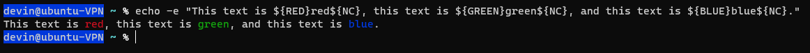

DigitalOcean VPN Server Project
**Purpose of this project:**  Create a custom cloud VPN server with the following features and requirements:
- The VPN server will support OpenVPN and Wiregaurd
- The OpenVPN server should be installed manually
- The Wiregaurd servers should be installed using AlgoVPN scriptsusing the same server as the OpenVPN server instead of a separate VM
- Create at least 3 cronjobs for the server
- Install a different shell than default and color code the bash terminal
- Edit the configuration file on the VM's shell and add custom aliases

## Step 1: Initial Ubuntu server setup on [DigitalOcean](www.digitalocean.com)

### 1a) Create a droplet on DigitalOcean
- Used an email account to sign up for DigitalOcean
- $4/month cheapest server is perfectly fine for this project
- Ubuntu 22.04 LTS x64, Basic, Regular SSD, $4/mo 
	- Select NYC1 datacenter to get cheapest server
- Set up a SSH for DigitalOcean using password
	- root: *insert password*
- Hostname: Ubuntu_VPN
	- Added keywords OpenVPN, Wireguard, IPSec
- ipv4_address

### 1b) Log in as root

```ssh root@ipV4_address```
	
### 1c) create new devin user and add to sudo group
Here you create a new user

```adduser devin```
>#password = *insert password*
    
```usermod -aG sudo devin```
>#adds devin to the sudo group

```id devin ```
>#to verify that the user is in the sudo group


## Step 2: Set up basic firewall rules on VPN server
```ufw app list```
>#checks to see what apps ufw allows

```ufw allow OpenSSH```
>#adds OpenSSH

```ufw enable```
>#enables the ufw firewall

```su devin```
>#switch from root to a sudo user because root has too much power

```sudo ufw allow 41235```

>#Change default ssh port to 41235 in ufw

```sudo nano /etc/ssh/sshd_config```

>#Change default ssh port to 41235 in ssh config file because just opening the port in ufw does not change ssh configs 
>>#Search for the #Port 22, remove the # and change the port number to 41235

```sudo systemctl restart ssh```
>#restart the ssh daemon after editing the config to use new ssh port number

```ss -an | grep 41235```
>#verify ssh is listening on port 41235 after ssh restart using the ss command

```exit```

```ssh devin@ipv4_address -p41235```
>#Log out of server and ssh back in using new ssh port number

## Step 3: Create a second Ubuntu server to act as a CA
- follow the same as Steps 1 & 2 to get the server built
- ubuntu-CA; *ipv4_address*
- root; *insert password*
- devin; *insert password*
### ***NOTE: Steps 3a-c are all done on the CA server***

### 3a) Install easy-rsa
```sudo apt update```

```sudo apt install easy-rsa```

### 3b) Prep a PKI directory
```mkdir ~/easy-rsa```

```ln -s /usr/share/easy-rsa/* ~/easy-rsa/```
>#This will create a new directory called `easy-rsa` in your home folder. We’ll use this directory to create symbolic links pointing to the `easy-rsa` package files that we’ve installed in the previous step. These files are located in the `/usr/share/easy-rsa` folder on the CA Server.

```chmod 700 ~/easy-rsa```

>#only owner can access the new PKI directory

```cd ~/easy-rsa```

```./easyrsa init-pki```
>#initialize the PKI inside the easy-rsa directory

### 3c) Create CA
>#ensure you are in the easy-rsa directory

```nano vars``` and paste the following, edit if you want

		set_var EASYRSA_REQ_COUNTRY    "US"
		set_var EASYRSA_REQ_PROVINCE   "Hawaii"
		set_var EASYRSA_REQ_CITY       "Manoa"
		set_var EASYRSA_REQ_ORG        "ITM684"
		set_var EASYRSA_REQ_EMAIL      "devin99@hawaii.edu"
		set_var EASYRSA_REQ_OU         "Community"
		set_var EASYRSA_ALGO           "ec"
		set_var EASYRSA_DIGEST         "sha512"

```./easyrsa build-ca```
>#To create the root public and private key pair for your Certificate Authority, run the `./easy-rsa` command again, this time with the `build-ca` option:

>#CA passphrase: *passphrase*

>#You now have two important files — `~/easy-rsa/pki/ca.crt` and `~/easy-rsa/pki/private/ca.key` — which make up the public and private components of a Certificate Authority.

>>#`ca.crt` is the CA’s public certificate file. Users, servers, and clients will use this certificate to verify that they are part of the same web of trust. Every user and server that uses your CA will need to have a copy of this file. 
    
>>#`ca.key` is the private key that the CA uses to sign certificates for servers and clients. If an attacker gains access to your CA and, in turn, your `ca.key` file, you will need to destroy your CA. This is why your `ca.key` file should ***only*** be on your CA machine and that, **ideally, your CA machine should be kept offline when not signing certificate requests as an extra security measure.**

## Step 4: Back to Step 1 of the OpenVPN installation 
- MAKE SURE you are ssh'd into your OpenVPN server, not the CA!!!

### 4a) Installing OpenVPN
```sudo apt update```

```sudo apt install openvpn easy-rsa```

>#the above commands ensure your OpenVPN server is updated then installs OpenVPN easy-rsa on the server.	

```mkdir ~/easy-rsa```

```ln -s /usr/share/easy-rsa/* ~/easy-rsa/```
>#The `ln` command is used to create links between files. The `-s` option specifies that a symbolic link should be created. In this case, the command creates symbolic links in the user's home directory (`~/easy-rsa/`) to all files in the `/usr/share/easy-rsa/` directory. This allows the user to access the files in `/usr/share/easy-rsa/` as if they were located in their home directory.

```chmod 700 ~/easy-rsa```
>#only owner can access new PKI directory


### 4b) Creating a PKI for OpenVPN server
```cd ~/easy-rsa``` if not already there

```nano vars``` & paste the following

	set_var EASYRSA_ALGO "ec"
	set_var EASYRSA_DIGEST "sha512"

>#note: make sure these are same algo and hash function as CA if you changed anything

>#always good to cat vars to make sure the file is correct

```./easyrsa init-pki```

>#- Once you have populated the `vars` file you can proceed with creating the PKI directory. To do so, run the `easyrsa` script with the `init-pki` option. Although you already ran this command on the CA server as part of the prerequisites, it’s necessary to run it here because your OpenVPN server and CA server have separate PKI directories

>#You'll note the pki directory has been added with private key directory (currently blank) and other config files

### 4c) Creating OpenVPN Server Certificate Request and Private Key
- Now you’ll call the `easyrsa` with the `gen-req` option followed by a Common Name (CN) for the machine. The CN can be anything you like but it can be helpful to make it something descriptive.

```./easyrsa gen-req server nopass```

>#This will create a private key for the server and a certificate request file called `server.req`. 


```sudo cp ~/easy-rsa/pki/private/server.key /etc/openvpn/server/```

>#Copy the server key to the `/etc/openvpn/server` directory. Recommend `ls` the copied directory to verify

## Step 5: Sign the OpenVPN server's CSR
- On the OpenVPN server, as your non-root user, use SCP or another transfer method to copy the `server.req` certificate request to the CA server for signing:

```scp -P 41235 ~/easy-rsa/pki/reqs/server.req devin@ipv4_address:/tmp```

>#Note 1:  scp uses same port as ssh, so need to use port 41235

>#Note 2: scp uses different syntax than ssh, so use -P 41235

### 5a) Sign into CA server as non-root user (commands not included, since you know how to do this by now and which port)

```ssh devin@ipv4_address -p41235```

```cd ~/easy-rsa```

```./easyrsa import-req /tmp/server.req server```

>#import the server certificate request using the `easyrsa` script


```./easyrsa sign-req server server``` 

>#enter pass phrase from Step 3c: *passphrase*
>#the above signs the cert request by running the `easyrsa` script with the `sign-req` option, followed by the request type and the Common Name. The request type can either be `client` or `server`.


- With those steps complete, you have signed the OpenVPN server’s certificate request using the CA server’s private key. The resulting `server.crt` file contains the OpenVPN server’s public encryption key, as well as a signature from the CA server. The point of the signature is to tell anyone who trusts the CA server that they can also trust the OpenVPN server when they connect to it.

```scp -P 41235 pki/issued/server.crt devin@ipv4_address:/tmp```

```scp -P 41235 pki/ca.crt devin@ipv4_address:/tmp```

>#copy the `server.crt` and `ca.crt` files from the CA server to the OpenVPN server:

**SWITCH BACK TO THE OPENVPN SERVER SHELL** & copy the files from `/tmp` to `/etc/openvpn/server`

```sudo cp /tmp/{server.crt,ca.crt} /etc/openvpn/server```

>#ls the receiving directory to make sure all files are where they should be


## Step 6: On the OpenVPN server, configure Cryptographic material (tls-crypt)
- For an additional layer of security, add an extra shared secret key that the server and all clients will use with [OpenVPN’s `tls-crypt` directive](https://build.openvpn.net/doxygen/group__tls__crypt.html#details). This option is used to obfuscate the TLS certificate that is used when a server and client connect to each other initially. It is also used by the OpenVPN server to perform quick checks on incoming packets: if a packet is signed using the pre-shared key, then the server processes it; if it is not signed, then the server knows it is from an untrusted source and can discard it without having to perform additional decryption work.  This option will help ensure that your OpenVPN server is able to cope with unauthenticated traffic, port scans, and Denial of Service attacks, which can tie up server resources. *It also makes it harder to identify OpenVPN network traffic.* 


```openvpn --genkey secret ta.key```

```sudo cp ta.key /etc/openvpn/server```
>#generates the `tls-crypt` pre-shared key and adds it to the openvpn/server directory

## Step 7: Generating a client certificate and key pair
- From the referenced instructions: While you can generate a private key and csr on a client machine, this guide outlines a process for generating the certificate request on the OpenVPN server. The benefit of this approach is that you can create a script that will automatically generate client configuration files that contain all of the required keys and certificates. This lets you avoid having to transfer keys, certificates, and configuration files to clients and streamlines the process of joining the VPN. You will generate a single client key and certificate pair for this guide. If you have more than one client, you can repeat this process for each one. Please note, though, that you will need to pass a unique name value to the script for every client. The first certificate/key pair is referred to as `client1`.

#Reminder: you are still operating on the OpenVPN server, not the CA server (yet)

```cd ~```

```mkdir -p ~/client-configs/keys```

```chmod -R 700 ~/client-configs```

>#The above makes a new 'client-configs' directory and makes it accessible only to the owner.

```cd ~/easy-rsa``

````./easyrsa gen-req client1 nopass```

>#This generates the `client1` certificate/keypair; do this for as many clients as you want


```cp pki/private/client1.key ~/client-configs/keys/```

>#Copies the `client1.key` file to the `~/client-configs/keys/` directory you created earlier


```scp -P 41235 pki/reqs/client1.req devin@ipv4_address:/tmp```

>#transfers the client1.key to the CA server for signing

### 7a) ******Now log in to your CA Server***. 

```ssh devin@ipv4_address -p41235```

```cd ~/easy-rsa```

```./easyrsa import-req /tmp/client1.req client1```

>#Navigate to the EasyRSA directory and import the certificate signing request (CSR)


```./easyrsa sign-req client client1```

>#Here the CA signs the CSR and creates the client1.crt file

>#CA passphrase: somethingsomethinghere

```scp -P 41235 pki/issued/client1.crt devin@ipv4_address:/tmp```

>#Transfers the newly created client1.crt file back to the OpenVPN server

### 7b) Switch back to your OpenVPN server shell
>#I ssh'd from the OpenVPN server to CA, so I just typed exit


```cp /tmp/client1.crt ~/client-configs/keys/```

>#- Copy the .crt file to correct directory on the OpenVPN server

```cp ~/easy-rsa/ta.key ~/client-configs/keys/```

```sudo cp /etc/openvpn/server/ca.crt ~/client-configs/keys/```

```sudo chown devin.devin ~/client-configs/keys/*```

>#copies the `ca.crt` and `ta.key` files to the `~/client-configs/keys/` directory as well, and sets the appropriate permissions for the sudo user
	
>#not a bad idea to verify all that with an `ls -lh ~/client-configs/keys/`

## Step 8: Configuring OpenVPN Server
- A lot can go wrong here, so be careful and don't skip any steps

```sudo cp /usr/share/doc/openvpn/examples/sample-config-files/server.conf /etc/openvpn/server/```

>#copy the sample `server.conf` file as a starting point for your own configuration file because if you don't make a copy, you are definitely going to screw something up (Murphy's Law)

```sudo nano /etc/openvpn/server/server.conf```

- Make the following edits (and don't mess up!!)
	- Search (ctrl w) for tls-auth
		"#" tls-auth ta.key 0 # This file is secret

		`tls-crypt ta.key`
	- change cipher from AES-256-CBC to GCM
		
		`cipher AES-256-GCM`

		`auth SHA256`
	- comment out `dh` and add `dh none` since you configured the certs to use ECC, so no need for DH seed file
	- Change default port to `443 tcp` to make sure not blocked by just about any network (that and tls-crypt do a great job with this)

		`port 443`
	
		`proto tcp`
	
	- add the following line

		`explicit-exit-notify 0`
	
	- uncomment the OpenVPN daemon privileges after initialization

		`user nobody`
	
		`group nogroup`
	
	>>>#note, says nobody in instructions reference instructions, but should be nogroup

	- **MAKE SURE** you do the Optional DNS changes to redirect all traffic through the VPN
		
		- uncomment `push` & `redirect-gateway def1 bypass-dhcp`


		- ... and uncomment the two push DNS that are using the OpenDNS IP addresses (those are good, or can replace with 1.1.1.1)

## Step 9: Adjusting the OpenVPN Server Networking Configuration
- There are some aspects of the server’s networking configuration that need to be tweaked so that OpenVPN can correctly route traffic through the VPN. The first of these is _IP forwarding_, a method for determining where IP traffic should be routed. This is essential to the VPN functionality that your server will provide.

```sudo nano /etc/sysctl.conf```

- add the following

	```net.ipv4.ip_forward = 1```

- verify by typing: 

	```sudo sysctl -p```


## Step 10: Firewall Configuration

```ip route list default```

>#Checks the default route your DigitalOcean server is using

- Then edit the ufw before.rules file to change the configuration.  Rules added to this file are "run" before the other ufw rules you manually enter in your configuration, like done previously in this document

```sudo nano /etc/ufw/before.rules```

>#towards the top of the file, add the following text, then save and exit nano.  

	# START OPENVPN RULES
	# NAT table rules
	*nat
	:POSTROUTING ACCEPT [0:0]
	# Allow traffic from OpenVPN client to eth0 (change to the interface you discovered!)
	-A POSTROUTING -s 10.8.0.0/8 -o eth0 -j MASQUERADE
	COMMIT
	# END OPENVPN RULES

- Next you need to edit the default ufw rules to allow forwarded packets

```sudo nano /etc/default/ufw```

	- change the DEFAULT_FORWARD_POLICY to ACCEPT, save and exit nano


```sudo ufw allow 443/tcp```

>#Tell ufw to allow TCP traffic on port 443 (which is what I chose earlier to allow best chance of OpenVPN not being blocked by firewalls on guest networks)

```sudo ufw disable```

```sudo ufw enable```

>#Disable and renable ufw to have the rules go into effect


## Step 11:  Starting OpenVPN


```sudo systemctl -f enable openvpn-server@server.service```

```sudo systemctl start openvpn-server@server.service```

>#Configures OpenVPN to start up on boot, then start the service

- Check to make sure OpenVPN service is running and active

```sudo systemctl pu openvpn-server@server.service```

>#**Server-side OpenVPN configuration is now complete!**

## Step 12: Create the Client Configuration Infrastructure

- Every OpenVPN client account must have its own config and each must align with the settings outlined in the server’s configuration file. Rather than writing a single configuration file that can only be used on one client, the following is process is used to first create a “base” configuration file then build a script which will allow you to generate unique client config files, certificates, and keys as needed.

### Step 12a) create the baseline VPN client config file

```mkdir -p ~/client-configs/files```

```cp /usr/share/doc/openvpn/examples/sample-config-files/client.conf ~/client-configs/base.conf```

>#the above creates a new directory for client config files and copies the example client config file into that directory to use as the new base config file
	
- Open baseline client config file and edit

```nano ~/client-configs/base.conf```

- change remote my-server-1 1194 to `remote OpenVPN_ipv4_address 443`
- change protocol to `tcp`
- uncomment user and group directives (nobody & nogroup)
- Find the directives that set the `ca`, `cert`, and `key`. Comment out these directives since you will add the certs and keys within the file itself shortly.
- Same for tls-auth as you will use your ta.key set up earlier
- change the cipher and auth to match what you used when creating the server.conf file earlier (`cipher AES-256-GCM`, `auth SHA256`)
- add the `key-direction 1` directive somewhere in the file. You **must** set this to “1” for the VPN to function correctly on the client machine
- save and close file

### Step 12b) Create a script to compile the VPN client config with relevant certificate, key, and encryption files
- This script will make a copy of the `base.conf` file you made, collect all the certificate and key files you’ve created for your client, extract their contents, append them to the copy of the base configuration file, and export all of this content into a new client configuration file. This means that, rather than having to manage the client’s configuration, certificate, and key files separately, all the required information is stored in one place. 
- Please note that any time you add a new client, you will need to generate new keys and certificates for it before you can run this script and generate its configuration file. See Step 13 (above) for what this means.

```nano ~/client-configs/make_config.sh```

	#!/bin/bash
	
	# First argument: Client identifier
	
	KEY_DIR=~/client-configs/keys
	OUTPUT_DIR=~/client-configs/files
	BASE_CONFIG=~/client-configs/base.conf
	
	cat ${BASE_CONFIG} \
		<(echo -e '<ca>') \
		${KEY_DIR}/ca.crt \
		<(echo -e '</ca>\n<cert>') \
		${KEY_DIR}/${1}.crt \
		<(echo -e '</cert>\n<key>') \
		${KEY_DIR}/${1}.key \
		<(echo -e '</key>\n<tls-crypt>') \
		${KEY_DIR}/ta.key \
		<(echo -e '</tls-crypt>') \
		> ${OUTPUT_DIR}/${1}.ovpn

```chmod 700 ~/client-configs/make_config.sh```
>#you know what this does

## Step 13: Generating Client Configurations

```cd ~/client-configs```

```./make_config.sh client1```

```ls ~/client-configs/files```

>#the above runs the script you created above and checks to make sure that the client config files mentioned above are there

- You need to transfer the client config file `client1.ovpn` to the device you plan to use as the client.  
	- Can use WinSCP/ Cyberduck, SCP, SFTP, etc
	- ex:  `sftp -P 41235 devin@OpenVPN_ipv4_address:client-configs/files/client1.ovpn ~/`

## Step 14:  Connect and test your OpenVPN client

- Download an OpenVPN client for your PC / Mac and Install
	- [Community Downloads | OpenVPN](https://openvpn.net/community-downloads/)
	- Import the client configuration into the OpenVPN client but don't connect yet 

- Open a browser and go to https://ipleak.net.  Look at your IP address and DNS settings without being on the VPN
	- Open a separate tab and do a speed test from Google or wherevers
	- Connect your OpenVPN  to your server
	- refresh the ipleak.net tab
	- should see DigitalOcean server IP address and DNS IP's for OpenDNS

## Step 15: Installing Wireguard using AlgoVPN scripts
- Note that installing AlgoVPN normally has you let the scripts create a DigitaOcean droplet for you; in this case, we don't want that.  Instead, we will do a "local install" on our existing Custom Cloud VPN server

- `ssh` into your VPN server

### Step 15a) Get a copy of algo and install Algo's core dependencies

```cd ~``` 

best to start from the home directory just in case

```git clone https://github.com/trailofbits/algo.git```
	
```sudo apt install -y --no-install-recommends python3-virtualenv```

### Step 15b) Install remaining Algo dependencies
```cd algo```
>#You must do this.

	python3 -m virtualenv --python="$(command -v python3)" .env && 
	source .env/bin/activate && 
	python3 -m pip install -U pip virtualenv && 
	python3 -m pip install -r requirements.txt


### Step 15c) Edit config.cfg file
- `nano config.cfg`
	- change wireguard port to `53`
	- change ssh port to `41235`
	- add/edit names of users for Wireguard and IPsec

### Step 15d) Run Algo install script
- While still in the algo directory
	- `sudo ./algo`
		- Note, you need to add sudo here because sudo privs are needed for some of the Algo script actions. 
	- Answer the questions provided on the screen.  First most important is the "Cloud prompt" shown below.  You need to choose "Install to existing" option.

- As the install progresses, you will be asked for IP address of the server
	- It will give you the option of `localhost`, and you should type that
	- **Eventually, it will ask you for the IP address of your server; provide the IP address of your DigitalOcean VPN server**
- If all goes well, the installation will complete and you will see something like this

## Step 16: Test & fix the OpenVPN server configurations changed by the AlgoVPN scripts

- When you test your previously-working OpenVPN, you will find that it doesn't finish the connection, times out, and keeps trying.  
	- As discussed in [algo/firewalls.md at master · trailofbits/algo · GitHub](https://github.com/trailofbits/algo/blob/master/docs/firewalls.md) , the AlgoVPN scripts use netfilter / iptable rules for Wireguard & IPSec Traffic
	- It turns off ufw, which we configured earlier for OpenSSH, changing the SSH port to 41235, and allowing OpenVPN traffic over port 443 / tcp
- Easiest thing to do is turn ufw back on in the OpenVPN server and add the necessary ports for Wireguard (53/udp, 500/udp, 4500/udp)
	- `sudo ufw status`
		- should show disabled after AlgoVPN installation is complete
	- `sudo ufw enable`
		- And verify with `sudo ufw status`
	- `sudo ufw allow 53/udp 500/udp 4500/udp`
		- And verify with `sudo ufw status`

- Test OpenVPN to ensure it works like before.

## Step 17: Download Wireguard and test on PC/Mac & phone

- After Algo has installed, you have to transfer the config files files from the VPN server for Wireguard and IPSec
	- On the VPN server, the config files will be in ~/algo/configs/ and then in a directory that has the IP address of your VPN server
	- By far the easist way to do this is with WinSCP or Cyberduck and drag the files over that you need for the clients
	
	I just used the command below on a new command terminal (not ssh into server)
	- sftp -P 41235 -r devin@openvpn_ipv4_address:~/algo/configs/openvpn_ipv4_address/wireguard/phone.png
	- Problems occurred... received "permission denied" for all the config files I wanted.  Why?  Because AlgoVPN limited access to those files to just root
		- Need to `sudo chmod 744` all the necessary config files and re-run the scp command

- Download Wireguard to your PC/Mac ([Installation - WireGuard](https://www.wireguard.com/install/)) or phone via an approved App store
	- Import the "Tunnel" into Wiregaurd (these are the files you transferred above).  Don't turn on Wireguard yet.
- Open a browser and go to ipleak.net.  Look at your IP address and DNS settings without being on Wireguard
- Open another tab with ipleak.net
	- Connect your Wireguard client to your server
	- refresh the ipleak.net tab
	- should see your DigitalOcean server IP address and DNS IP's for Cloudflare or whatever you set in the Wireguard config file.
- For your own interest, recommend you do a speed test without VPN, when connected on OpenVPN, and when connected on Wireguard


## Step Extra 1: Fun extra stuff (installing new shell on server)

I installed a different shell on my Linux server.
- ``cat /etc/shells``
	- This shows a list of shells currently installed on the server.
- Choose the shell that you want to install. Some popular shells include Bash, Zsh, Fish, and Tcsh I chose zsh. Install the shell.
	- ``sudo apt-get install zsh``
- After installation, switch to the new shell by running:
	- ``chsh -s /path/to/new/shell``
	- In my case for zsh, I did: ``chsh -s /usr/bin/zsh``
- Log out of sessions and log back in to see the new shell
- When logging in, there is a new user configuration function that auto runs.
	- I selected for the function to the recommended configuration. You can do differently.


## Step Extra 2: Fun extra stuff (adding color coding to server)

To add color coding to your terminal, you can modify the shell's configuration file to include color codes in the output of various commands. Here are the steps to add color coding to the `bash` shell:

1. Open your `~/.bashrc` file in a text editor. This file contains commands that are executed each time you open a new terminal window.

   ```
   nano ~/.bashrc
   ```

2. Scroll to the bottom of the file and add the following lines:

   ```
   # Define some color codes
   export RED='\033[0;31m'
   export GREEN='\033[0;32m'
   export YELLOW='\033[0;33m'
   export BLUE='\033[0;34m'
   export PURPLE='\033[0;35m'
   export CYAN='\033[0;36m'
   export WHITE='\033[0;37m'
   export NC='\033[0m'
    ```

   These lines define several color codes using escape sequences and export them as environment variables. The `NC` variable resets the color back to the default.

   The last line shows an example usage of the color codes. The `-e` option enables interpretation of escape sequences in the `echo` command.

3. Save and exit the file.

4. Reload your `~/.bashrc` file to apply the changes to your current terminal session:

   ```
   source ~/.bashrc
   ```

Now you can use the color codes in your commands to add color to the output. For example, you can use `${RED}` to make text red, `${GREEN}` to make text green, and so on. Use `${NC}` to reset the color back to the default.

I did not have enough time to test it, but it seems that you would have to use that commannd every time you log in in order to get the color coding working.

Example usage:
```
echo -e "This text is ${RED}red${NC}, this text is ${GREEN}green${NC}, and this text is ${BLUE}blue${NC}."
```

From the example code, it should look like this after it runs:



## Step Extra 3: Convience (adding alias)

To add aliases to your server, follow these steps:

1. Open your `.bashrc` file in a text editor. This file contains commands that are executed each time you open a new terminal window.

   ```
   nano ~/.bashrc
   ```

2. Scroll to the bottom of the file and add your desired aliases using the `alias` command. Here are a few examples:

   ```
   # Alias to show disk usage in human-readable format
   alias dfh='df -h'
   
   # Alias to make the clear command easier to run wth just a "c"
   alias c=clear
   
   # Alias to show a summary of running processes
   alias top='top -o %CPU -n 10'
   ```

   These aliases will make it easier to run common commands on your server.

3. Save and exit the file.

4. Reload your `.bashrc` file to apply the changes to your current terminal session:

   ```
   source ~/.bashrc
   ```

Now you can use the aliases in your commands to save time and improve your workflow. For example, you can use `c` instead of `clear` to clear the terminal.
